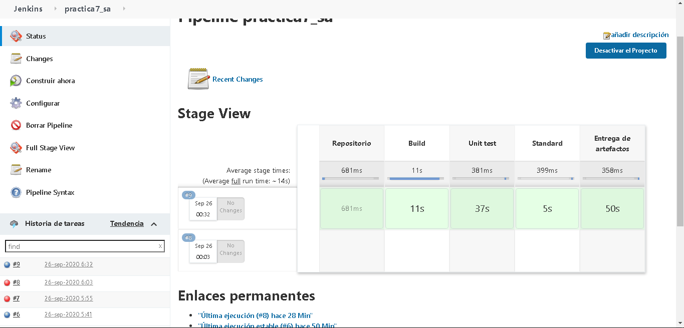

# Practica 7 - Software Avanzado
Repositorio de artefactos: https://github.com/Kevin140414/Practica7SA_Artefactos

En esta practica se configuro Jenkins para que se encargara de cada vez que se realice un push
este sea actualizado en el servidor de jenkins, realice las prebas unitarias y el escaneo de estandar de codigo (utilizando para ello standard de nodejs)
y por ultimo construya los artefactos y realice un push con los mismos hacia el repositorio mostrado anteriormente.enerados.

Captura del proceso:
<p align="center">  </p>

#### Practica 6 - Software Avanzado
Video:

###### ESB
El objetivo del ESB es mejorar y ayudar al crecimiento de un negocio.
El Bus de Servicios Empresariales debe ser lo bastante robusto como para que permita administrar los cambios en los requerimientos sin que esto suponga en los servicios ya instalados incidencia alguna. Sistema de eventos e infraestructura deben ser capaces de conectar cualquier recurso de TI con independencia de qué tecnología emplee éste.

###### Microservicio cliente
- Solicitar pedido al restaurante
- Verificar estado del pedido al restaurante
- Verificar estado del pedido al repartidor

###### Microservicio Restaurante
- Recibir pedido del cliente
- Informar estado del pedido al cliente
- Avisar al repartidor que ya está listo el pedido

###### Microservicio Repartidor
- Recibir pedido del restaurante
- Informar estado del pedido al cliente
- Marcar como entregado

# Requisitos
  - PHP 5.6 o superior (puede funcionar con algunas versiones inferiores).
  - nodejs

### Instalación
```sh
$ apt-get install php
$ apt-get install node
$ apt-get install npm
```
### Ejecutar
```sh
$ php cliente.php
$ npm start
```
# Construcción de artefactos
- Al ejecutar el siguiente comando se genera una carpeta llamada 'dist', la cual contiene los .tar.gz de cada artefacto de la aplicación.  
```sh
$ sh build.sh
```
